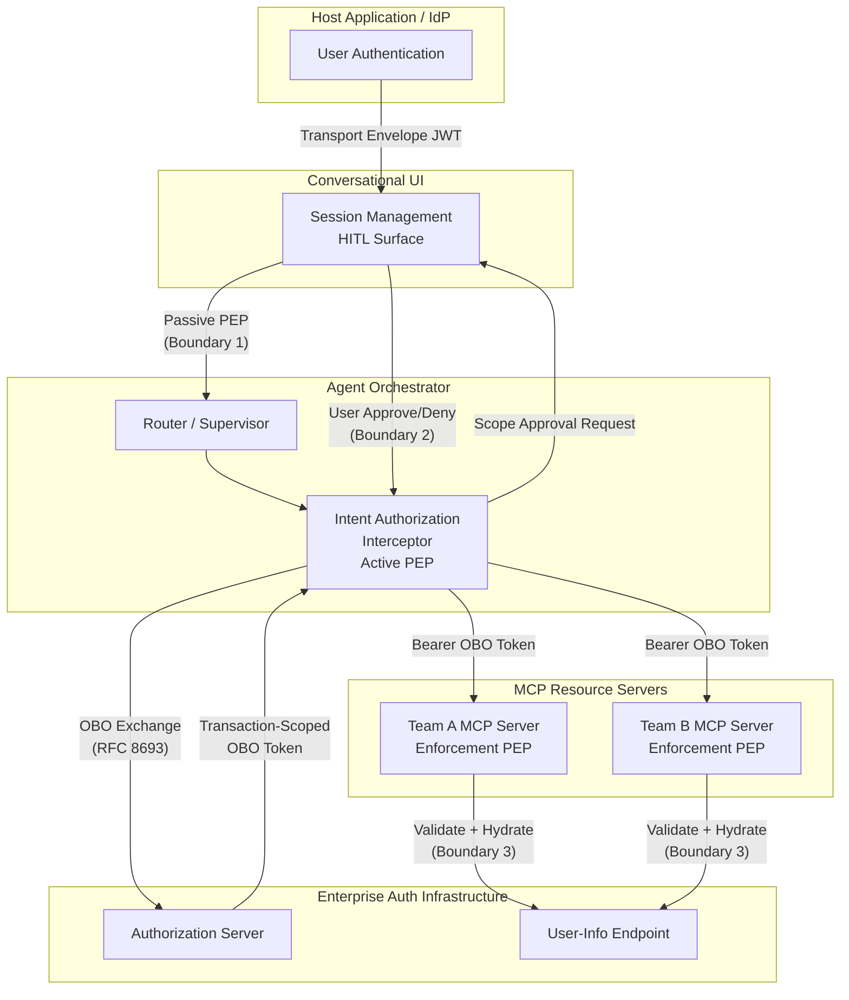
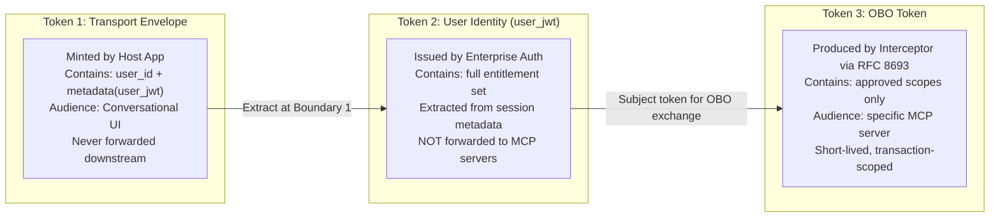
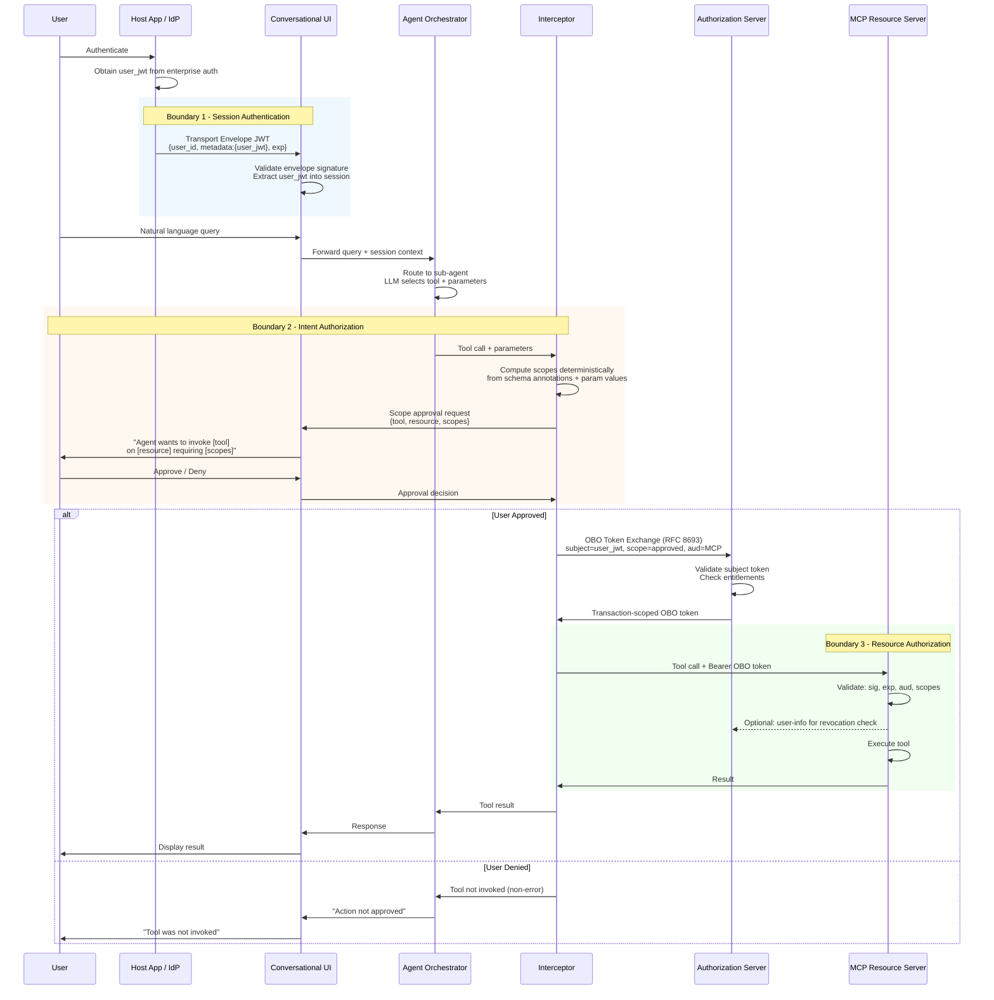

# User-Delegated Authorization with Intent-Bounded Scope Control for Agentic Frameworks

## RFC Frame - Working Draft v3

**Status:** Pre-draft frame for expansion into full RFC
**Pattern Name:** User-Delegated Authorization via Token Envelope Propagation with Intent-Bounded Scope Control
**Target Audience:** Enterprise architects, identity/security engineers, agentic AI platform teams
**Revision Note:** This revision consolidates the v2 frame using structural patterns from draft-ni-wimse-ai-agent-identity-02, adds RFC 2119 normative language, introduces mermaid diagrams, and addresses technical gaps identified in architectural review.

---

## 1. Introduction

### 1.1 Purpose

This document describes how existing standards - OAuth 2.1, RFC 8693 (Token Exchange), OIDC, and the Model Context Protocol (MCP) - compose to solve two problems unique to enterprise agentic architectures: identity propagation from user to resource server, and intent-bounded scope control over LLM-selected tool invocations.

This is an applicability and composition document. It does not define new protocols.

### 1.2 Applicability

This pattern applies to agentic systems where:

- Users delegate intent to LLMs that autonomously select tools and parameters.
- Resource servers require authenticated user identity propagation across multiple service boundaries.
- The scope exercised at terminal resource servers MUST reflect what the user intended, not what the LLM inferred.
- Service-providing teams own and operate their own MCP resource servers under federated governance.

This pattern does not apply to non-agentic systems (direct user tool selection), systems without human-in-the-loop requirements, public API servers without enterprise governance, or single-operator deployments with no federated team model.

---

## 2. Conventions and Definitions

### 2.1 Normative Language

The key words "MUST", "MUST NOT", "REQUIRED", "SHALL", "SHALL NOT", "SHOULD", "SHOULD NOT", "RECOMMENDED", "NOT RECOMMENDED", "MAY", and "OPTIONAL" in this document are to be interpreted as described in BCP 14 [RFC2119] [RFC8174] when, and only when, they appear in all capitals, as shown here.

### 2.2 Key Concepts

**Service Boundary** - The point where one deployed process, container, or system ends and another begins. A service boundary does not inherently carry an authorization decision.

**Authorization Boundary** - The point where a trust decision is evaluated: "Who are you, and what are you allowed to do?" Authorization boundaries MAY or MAY NOT coincide with service boundaries.

**Policy Enforcement Point (PEP)** - A component that evaluates and enforces authorization decisions at a boundary. This document classifies PEPs into three types:

- *Passive PEP:* Validates session legitimacy without making resource-level decisions.
- *Active PEP:* Determines whether an action should proceed, including soliciting user consent and producing scoped credentials.
- *Enforcement PEP:* Mechanically validates that a presented credential satisfies the requirements of the requested operation.

**Identity Propagation** - The process by which a user's identity, authorization context, and entitlement boundaries are forwarded from the point of original authentication through intermediate system layers to the point where resource access decisions are made.

**Intent-Bounded Authorization** - An authorization model in which the scope of a credential reflects not only what the user is entitled to do, but what the user intended to do in a specific interaction. Prevents valid credentials from being exercised in unauthorized contexts by an autonomous agent.

**Scope Narrowing** - The process of exchanging a broad credential for a narrower one that authorizes only a specific set of actions. In this pattern, scope narrowing is performed via OBO token exchange and is bounded by the user's explicit approval.

**Declarative Scope Annotation** - Metadata attached to an MCP tool's parameter schema that declares the parameter as authorization-relevant and maps its runtime value to a scope template.

**Hallucination-Driven Scope Misuse** - A threat specific to agentic architectures in which an LLM selects tool parameters that do not reflect the user's intent, causing the system to exercise valid entitlements against unintended resources.

**Dual-Identity Credential** - A credential that contains the identifiers and associated keys of both an agent and its owner/user. Defined in draft-ni-wimse-ai-agent-identity-02. Reserved for future composition with this pattern (see Section 12.1).

---

## 3. Use Cases

Concrete scenarios that motivate this pattern. These establish the business need before the technical mechanism.

### 3.1 Service Desk Agent

An IT support team onboards to a shared agentic assistant by contributing a domain-specific agent configuration and an MCP resource server that exposes tools for password reset, account unlock, and ticket creation. A user asks the assistant: "Reset the password for the shared-ops account."

Without intent-bounded authorization, the LLM selects the password reset tool but could hallucinate the target account - resetting credentials for a production service account instead of the user's intended target. The user's entitlements technically permit both operations. Standard token validation passes, but the authorization intent has been violated.

### 3.2 Finance Agent

A finance team provides tools for expense report retrieval and general ledger queries. A user asks: "Pull my Q3 expense report." The LLM correctly identifies the expense tool but selects parameters that also query payroll data the user is entitled to access but did not request. The agent exercises valid credentials in an unauthorized context.

### 3.3 The Compound Problem

These scenarios reveal two gaps that compound. Identity must propagate through the agentic framework (the propagation problem), and the scope exercised at the terminal resource server must reflect what the user actually intended, not what the LLM inferred (the intent problem). Solving only one leaves the other exposed.

---

## 4. Standards and Prior Art

### 4.1 IETF Drafts

- **draft-klrc-aiagent-auth-00** - Proposes the Agent Identity Management System (AIMS) conceptual model. Defines a layered stack: Identifier, Credentials, Attestation, Provisioning, Authentication, Authorization, Policy, and Compliance. Addresses user-to-agent delegation and human-in-the-loop.
- **draft-ni-wimse-ai-agent-identity-02** - WIMSE applicability for AI agents. Introduces dual-identity credentials binding agent identity to owner/user identity, and the concept of a proxy entity managing credential issuance on behalf of agents. Defines three issuance models: Agent-Mediated, Owner-Mediated, and Server-Mediated.
- **draft-zheng-dispatch-agent-identity-management-00** - Agent registration, identifier assignment, and gateway-based identity management.
- **draft-abbey-scim-agent-extension-00** - Extends SCIM to provision AI agents as managed identities.
- **draft-yl-agent-id-requirements-00** - Requirements for digital identity management in AI agent communication protocols.

### 4.2 OAuth and Identity Standards

- **OAuth 2.1 (IETF Draft)** - Foundation for MCP authorization flows.
- **RFC 8693 (Token Exchange)** - Framework for exchanging one security token for another. Basis for the On-Behalf-Of (OBO) token exchange in this pattern.
- **RFC 7662 (Token Introspection)** - Protocol for resource servers to validate opaque tokens.
- **RFC 8707 (Resource Indicators)** - Mechanism for clients to indicate the target resource server when requesting tokens.
- **RFC 9728 (Protected Resource Metadata)** - Discovery mechanism for MCP servers to advertise authorization server locations.

### 4.3 This Document's Role

This pattern composes capabilities available in any conformant implementation of the MCP specification, OAuth 2.0 token exchange, and standard JWT validation. It aligns with draft-klrc-aiagent-auth's AIMS model (delegation, transaction tokens, human-in-the-loop), draft-ni-wimse-ai-agent-identity's dual-identity concept, and the MCP specification's classification of MCP servers as OAuth Resource Servers. Reference implementations MAY leverage specific frameworks but the pattern does not depend on any particular vendor or implementation.

---

## 5. System Architecture

### 5.1 System Components

The architecture involves five distinct components arranged in a pipeline:

1. **Host Application / IdP** - The trusted application where the user originally authenticates. Holds or can obtain the user's identity token (JWT) from the enterprise authorization infrastructure.

2. **Conversational UI** - The user-facing assistant interface embedded within the trusted application. Manages session state and provides the HITL interaction surface.

3. **Agent Orchestrator** - The multi-agent supervisor that routes user queries to domain-specific sub-agents and their associated tools. The Orchestrator is a service boundary but explicitly NOT an authorization boundary.

4. **Intent Authorization Interceptor** - A policy enforcement component within the Agent Orchestrator. Inspects LLM-generated tool calls, computes required scopes deterministically, presents scope requests to the user for approval, and performs OBO token exchange.

5. **MCP Resource Server(s)** - Team-owned resource servers hosting service-specific tools. Each validates incoming OBO tokens and enforces scope-based access control per tool.



### 5.2 Token Architecture

Three distinct tokens participate in the flow. Each has a distinct purpose, audience, and lifetime.



**Transport Envelope Token** - Structure: `{user_identifier, metadata: {user_jwt}, exp}`. Signed with the Conversational UI's auth secret. Audience: the Conversational UI service. This token MUST NOT be forwarded to downstream services.

**User Identity Token (user_jwt)** - Issued by the enterprise authorization infrastructure. Contains the user's full entitlement set. This token MUST NOT be forwarded directly to MCP resource servers.

**Transaction-Scoped OBO Token** - Scoped to only the entitlements approved by the user for a specific tool invocation. Audienced to the target MCP resource server. This is the only token the MCP resource server SHALL accept.

---

## 6. Authorization Model

This architecture defines three authorization boundaries, each with a distinct trust decision. Security analysis is co-located with each boundary per the structural pattern of draft-ni-wimse-ai-agent-identity-02.

### 6.1 Boundary 1 - Session Authentication

**PEP Classification:** Passive PEP

**Trust Decision:** "Is this a legitimate user session originating from a trusted application?"

**Mechanism:** The Conversational UI MUST validate the Transport Envelope Token signature. It MUST extract `user_identifier` and `user_jwt` from claims/metadata and establish session context.

**Normative Requirements:**

- The Conversational UI MUST validate the Transport Envelope Token's cryptographic signature before establishing a session.
- The Conversational UI MUST extract and securely store the `user_jwt` in session metadata.
- The Conversational UI MUST NOT make resource-level authorization decisions at this boundary.
- The Conversational UI MUST NOT evaluate entitlements or scopes at this boundary.

**Threats:**

- *Transport Envelope Exposure:* The `user_jwt` stored in session metadata is a sensitive credential. Session storage MUST be encrypted at rest with appropriate access controls.
- *Session Hijack:* If the session token is stolen, an attacker inherits the user's identity context. Implementations SHOULD bind sessions to client fingerprints where feasible.

### 6.2 Boundary 2 - Intent Authorization

**PEP Classification:** Active PEP (the gatekeeper)

**Trust Decision:** "What does this user intend to authorize the agent to do right now?"

**Mechanism:** The Interceptor inspects the LLM's generated tool call, computes required scopes deterministically from declarative tool schema annotations and parameter values, presents the scope request to the user for approval, and upon approval performs OBO token exchange.

**Key Property:** This boundary converts the LLM's unverified inference into a user-sanctioned action. Before this boundary, the system knows what the user *can* do (entitlements). After this boundary, the system knows what the user *wants to do right now* (intent).

**Normative Requirements:**

- The Interceptor MUST compute required scopes as a deterministic function of tool schema annotations and LLM-provided parameter values. The Interceptor MUST NOT consult the LLM about what scopes are needed.
- The Interceptor MUST present computed scopes to the user via the Conversational UI before performing OBO token exchange. The presentation MUST include: the tool name, the target resource(s), and the specific scope(s) requested.
- Upon user denial, the Interceptor MUST halt the tool invocation, MUST NOT perform OBO token exchange, and MUST return control to the conversational flow with a non-error status.
- Upon user approval, the Interceptor MUST perform OBO token exchange per Section 7.2.
- The Interceptor MUST create an auditable consent record for each approval: user identifier, approved scopes, tool name, target resource, and timestamp.

**Threats:**

- *Hallucination-Driven Scope Misuse:* The primary threat this architecture addresses. Without the HITL step, an LLM can exercise any scope in the user's entitlement set without the user's awareness. The HITL step makes scope selection visible and user-controllable.
- *Interceptor Compromise:* The Interceptor initiates OBO token exchange, making it a privileged component. It MUST run in a trusted execution context within the platform (not within team-owned infrastructure). Its communication with the Authorization Server MUST be mutually authenticated. Its approval records SHOULD be tamper-evident.
- *Scope Aggregation Abuse:* Scope computation from tool annotations is additive (union of scope-bearing parameters). Implementations SHOULD consider whether scope intersection or subtraction logic is needed based on the agent's own permission boundaries.

### 6.3 Boundary 3 - Resource Authorization

**PEP Classification:** Enforcement PEP (the lock)

**Trust Decision:** "Is this action permitted by the presented token?"

**Mechanism:** The MCP resource server's token verification layer validates the OBO token and enforces scope-based access control.

**Key Property:** This boundary is strict and mechanical. It does not reason about intent. The intent question was resolved upstream at Boundary 2. This boundary is owned and operated by the service-providing team.

**Normative Requirements:**

- The MCP resource server MUST validate the OBO token's cryptographic signature against the Authorization Server's public key.
- The MCP resource server MUST check `exp` (expiration) and `nbf` (not-before) claims.
- The MCP resource server MUST validate that the `aud` (audience) claim matches this MCP resource server's resource identifier.
- The MCP resource server MUST extract scopes from the token and compare against the tool's required scopes for the given parameters.
- The MCP resource server MAY call the enterprise user-info endpoint for real-time revocation checking and scope hydration.
- The MCP resource server MUST NOT invoke the tool if any validation step fails.

**Threats:**

- *Audience Bypass:* If the MCP resource server fails to validate the `aud` claim, tokens intended for other services could be replayed. Audience validation MUST be performed on every request.
- *User-Info Endpoint Dependency:* If the MCP resource server calls the user-info endpoint, this introduces a runtime dependency. The MCP resource server SHOULD cache results with a TTL of 1-5 minutes (RECOMMENDED: 3 minutes). If the endpoint is unreachable, the server MUST fail closed (deny the request) unless a valid cached result exists within TTL.
- *Team-Owned Server Trust:* MCP resource servers are deployed on team-specific infrastructure. A misconfigured server that accepts tokens without proper validation weakens the security guarantees of the overall architecture. Platform governance MUST validate compliance during team onboarding.

### 6.4 Mandatory Path Enforcement

Because the MCP resource server MUST validate the `aud` claim and only accept tokens audienced to itself, and because only the Interceptor produces such tokens via OBO exchange, the authorization path through the Interceptor is mandatory. A direct attempt to present the user's original broad token to the MCP resource server MUST fail on audience mismatch.

This property is enforced by cryptographic token validation, not by application-layer routing conventions. The security model does not depend on callers voluntarily routing through the Interceptor.

### 6.5 Non-Boundaries

The Agent Orchestrator is a service boundary but explicitly NOT an authorization boundary. It relays credentials and tool calls without evaluating them. The boundary between the Agent Orchestrator and individual sub-agents is similarly a service boundary carrying no authorization decision.

---

## 7. Interceptor Mechanics

### 7.1 Scope Computation Model

The Interceptor computes required scopes as a deterministic function of two inputs:

1. **Tool schema declarative scope annotations** - Each authorization-relevant MCP tool parameter is annotated with a scope template by the service-providing team. The annotation declares that a parameter's runtime value maps to a specific scope pattern.

2. **LLM-provided parameter values** - The concrete values the LLM selected for annotated parameters.

The scope computation is mechanical string interpolation: the parameter value is substituted into the scope template. Example:

```
Tool: reset_password
Parameter: target_account (annotated: "scope: account:{value}:password:reset")
LLM value: "shared-ops"
Computed scope: "account:shared-ops:password:reset"
```

The Interceptor MUST NOT use any LLM output to determine scope requirements. Scope computation MUST be deterministic and reproducible from the tool schema and parameter values alone.

### 7.2 OBO Token Exchange

Upon user approval, the Interceptor MUST perform an On-Behalf-Of token exchange (RFC 8693) with the enterprise Authorization Server:

**Request parameters:**

| Parameter | Value | Requirement |
|-----------|-------|-------------|
| `grant_type` | `urn:ietf:params:oauth:grant-type:token-exchange` | REQUIRED |
| `subject_token` | The user's `user_jwt` from session metadata | REQUIRED |
| `subject_token_type` | `urn:ietf:params:oauth:token-type:jwt` | REQUIRED |
| `scope` | Space-delimited list of approved scopes | REQUIRED |
| `audience` | Target MCP resource server's resource identifier | REQUIRED |
| `requested_token_type` | `urn:ietf:params:oauth:token-type:access_token` | RECOMMENDED |

**Response:**

The Authorization Server MUST validate the subject token and evaluate requested scopes against the user's entitlements. The issued OBO token MUST be:

- Scoped to exactly the approved entitlements (principle of least privilege)
- Audienced to the specific MCP resource server via the `aud` claim
- Short-lived with a transaction-scoped lifetime (RECOMMENDED: 5-15 minutes)

### 7.3 Token Lifetime and Refresh

- The OBO token MUST have a short, transaction-scoped lifetime. Implementations SHOULD use a lifetime of 5-15 minutes.
- The user's original identity token (`user_jwt`) lifetime is set by the enterprise Authorization Server. If the Conversational UI session outlives the inner token, downstream operations will fail.
- Implementations MUST handle token expiration by one of the following strategies: (a) bounding session lifetime to token TTL, (b) implementing transparent token refresh at the session layer using a refresh token, or (c) treating authorization failures as re-authentication signals propagated back through the Conversational UI.
- If refresh tokens are used, the Conversational UI MUST store them with the same security protections as the identity token.
- OBO tokens MUST NOT be refreshed. Each tool invocation MUST produce a fresh OBO token via a new exchange.

### 7.4 Multi-Tool Batch Invocation

When an LLM generates multiple tool calls within a single agent turn:

**Scope Aggregation:** The Interceptor MUST aggregate scopes from all tools using set union. If tool A requires `[read:X]` and tool B requires `[read:X, write:Y]`, the aggregate request SHOULD be `[read:X, write:Y]`.

**Approval Presentation:** The Interceptor SHOULD present all tools and their aggregate scopes in a single HITL approval request, grouping by target MCP resource server if multiple servers are involved.

**Approval Semantics:**

- If the user approves: all tools proceed. The Interceptor MUST produce one OBO token per target MCP resource server, containing only the scopes for tools targeting that server.
- If the user denies: no tools proceed. The agent continues conversational flow.
- Implementations MAY support partial approval (user selects specific tools). Only selected tools proceed.

**Atomicity:** If one OBO exchange fails (e.g., user lacks entitlement for one tool's scope), that tool's invocation MUST fail, but other tools SHOULD proceed if their OBO exchanges succeed.

---

## 8. Error Handling and Recovery

### 8.1 OBO Exchange Failures

If the Authorization Server rejects an OBO exchange (user lacks entitlement for the requested scope), the Interceptor MUST propagate the rejection to the Conversational UI. The tool MUST NOT be invoked. The error message SHOULD indicate insufficient permissions without exposing internal entitlement details.

### 8.2 Token Validation Failures at MCP Resource Server

| Failure Condition | HTTP Response | Requirement |
|---|---|---|
| Invalid signature | 401 Unauthorized, `invalid_token` | MUST reject |
| Expired token (`exp` in the past) | 401 Unauthorized, `token_expired` | MUST reject |
| Audience mismatch | 401 Unauthorized, `invalid_token` | MUST reject |
| Insufficient scopes | 403 Forbidden, `insufficient_scope` | MUST reject |
| Revocation detected via user-info | 401 Unauthorized, `revoked_token` | MUST reject |

In all failure cases, the MCP resource server MUST NOT invoke the tool.

### 8.3 Revocation and Real-Time Validation

When a user's entitlements change at the IdP (administrator revokes a scope), subsequent OBO exchanges will fail if the user lacks the revoked scope. This provides eventual consistency for entitlement revocation.

For real-time revocation checking:

- If the MCP resource server calls the user-info endpoint, it SHOULD cache results with a TTL of 1-5 minutes (RECOMMENDED: 3 minutes).
- If the user-info endpoint is unreachable, the MCP resource server MUST fail closed: deny the request unless a valid cached result exists within TTL.
- Explicit token revocation (RFC 7009) is OPTIONAL for OBO tokens. Implementations MAY rely on short token lifetimes for revocation semantics.

---

## 9. End-to-End Flow



---

## 10. Governance and Onboarding

Service-providing teams integrating into the platform MUST satisfy the following governance requirements:

**Agent Configuration Registration:** The team MUST register their domain-specific agent configuration in the agent configuration registry, including tool schemas with declarative scope annotations for all authorization-relevant parameters.

**MCP Resource Server Compliance:** The team's MCP resource server MUST implement the token verification patterns specified by Section 6.3, including audience validation, scope enforcement, and (where required by platform policy) real-time revocation checking.

**Scope Definition:** The team MUST define the scopes required by each tool. Scopes MUST be expressible as templates that resolve deterministically from tool parameter values per Section 7.1.

**Infrastructure Ownership:** MCP resource servers are deployed, operated, and maintained on the team's own infrastructure. The platform MUST NOT host or manage team-owned resource servers.

**Compliance Validation:** The platform SHOULD validate MCP resource server compliance during onboarding through automated token verification testing: issuing test tokens with correct and incorrect audience/scope combinations and verifying appropriate accept/reject behavior.

---

## 11. Normative Requirements Summary

This section consolidates all normative requirements by component for implementer reference. Requirements are derived from the sections above and use the same numbering.

### 11.1 Conversational UI

| ID | Requirement | Level | Source |
|---|---|---|---|
| CUI-1 | Validate Transport Envelope Token signature | MUST | 6.1 |
| CUI-2 | Extract and securely store user_jwt in session metadata | MUST | 6.1 |
| CUI-3 | Encrypt session storage at rest | MUST | 6.1 |
| CUI-4 | Not make resource-level authorization decisions | MUST NOT | 6.1 |
| CUI-5 | Not forward Transport Envelope Token downstream | MUST NOT | 5.2 |
| CUI-6 | Handle token expiration via bound session lifetime, refresh, or re-auth signal | MUST | 7.3 |
| CUI-7 | Protect refresh tokens with same security as identity token | MUST | 7.3 |

### 11.2 Intent Authorization Interceptor

| ID | Requirement | Level | Source |
|---|---|---|---|
| INT-1 | Compute scopes deterministically from schema annotations + parameter values | MUST | 7.1 |
| INT-2 | Not consult LLM for scope determination | MUST NOT | 7.1 |
| INT-3 | Present computed scopes to user before OBO exchange | MUST | 6.2 |
| INT-4 | Presentation includes tool name, target resource, specific scopes | MUST | 6.2 |
| INT-5 | On user denial: halt invocation, do not exchange, return non-error status | MUST | 6.2 |
| INT-6 | On user approval: perform OBO exchange per Section 7.2 | MUST | 6.2 |
| INT-7 | Create auditable consent record per approval | MUST | 6.2 |
| INT-8 | Run in trusted execution context within platform | MUST | 6.2 |
| INT-9 | Mutually authenticate with Authorization Server | MUST | 6.2 |
| INT-10 | Consent records should be tamper-evident | SHOULD | 6.2 |
| INT-11 | Aggregate multi-tool scopes using set union | MUST | 7.4 |
| INT-12 | Present multi-tool approvals grouped by MCP server | SHOULD | 7.4 |
| INT-13 | Produce one OBO token per target MCP server | MUST | 7.4 |
| INT-14 | Not refresh OBO tokens; each invocation produces a fresh token | MUST | 7.3 |

### 11.3 MCP Resource Server

| ID | Requirement | Level | Source |
|---|---|---|---|
| RS-1 | Validate OBO token cryptographic signature | MUST | 6.3 |
| RS-2 | Check exp and nbf claims | MUST | 6.3 |
| RS-3 | Validate aud claim matches server's resource identifier | MUST | 6.3 |
| RS-4 | Extract and compare scopes against tool requirements | MUST | 6.3 |
| RS-5 | Not invoke tool if any validation step fails | MUST NOT | 6.3 |
| RS-6 | May call user-info endpoint for revocation/hydration | MAY | 6.3 |
| RS-7 | Cache user-info results with 1-5 min TTL (recommended: 3 min) | SHOULD | 6.3 |
| RS-8 | Fail closed if user-info endpoint unreachable (unless valid cache exists) | MUST | 6.3 |
| RS-9 | Return 401 for signature, expiration, audience failures | MUST | 8.2 |
| RS-10 | Return 403 for insufficient scope | MUST | 8.2 |

### 11.4 Authorization Server

| ID | Requirement | Level | Source |
|---|---|---|---|
| AS-1 | Validate subject token during OBO exchange | MUST | 7.2 |
| AS-2 | Evaluate requested scopes against user entitlements | MUST | 7.2 |
| AS-3 | Issue OBO token scoped to exactly the approved entitlements | MUST | 7.2 |
| AS-4 | Audience-scope OBO token to specific MCP server | MUST | 7.2 |
| AS-5 | Issue short-lived OBO tokens (recommended: 5-15 min) | SHOULD | 7.2 |
| AS-6 | Reject OBO requests where user lacks entitlement | MUST | 8.1 |

### 11.5 Platform Governance

| ID | Requirement | Level | Source |
|---|---|---|---|
| GOV-1 | Teams must register agent config with scope annotations | MUST | 10 |
| GOV-2 | Teams must implement token verification per Section 6.3 | MUST | 10 |
| GOV-3 | Scopes must be deterministically resolvable from parameters | MUST | 10 |
| GOV-4 | Platform must not host team-owned MCP servers | MUST NOT | 10 |
| GOV-5 | Platform should validate compliance via automated testing | SHOULD | 10 |

---

## 12. Extensibility and Future Work

### 12.1 Agent Identity Composition (WIMSE)

This version authenticates user identity at the MCP resource server but does not independently authenticate the agent making the call. draft-ni-wimse-ai-agent-identity-02 defines dual-identity credentials that bind agent identity to owner/user identity through three issuance models (Agent-Mediated, Owner-Mediated, Server-Mediated).

Future versions SHOULD compose dual-identity credentials with this pattern:

- The OBO token SHOULD include an optional `agent_id` claim identifying the agent configuration that selected the tool (for audit and governance).
- The MCP resource server MAY validate that the `agent_id` matches approved agent registrations.
- The Interceptor MAY act as a WIMSE Identity Proxy, managing credential issuance on behalf of agents after explicit user approval (Boundary 2).

### 12.2 Scope Annotation Schema Standardization

The declarative scope annotation schema (Section 7.1) requires standardization. Open question: is this an extension to the MCP tool schema, or a separate metadata document registered alongside the agent configuration?

### 12.3 Risk-Driven Approval Classification

The current pattern requires HITL approval for all tool invocations. Future work MAY define a risk classification mechanism that allows low-sensitivity operations to proceed without user confirmation, based on tool-level risk metadata.

### 12.4 MCP Server-to-Server Chaining

When one MCP resource server invokes tools on another MCP resource server, the token propagation model requires extension. The calling server would need to perform its own OBO exchange, creating a chain of narrowing tokens.

### 12.5 Audit and Compliance Logging

A standardized audit log schema for consent records, token exchange events, and tool invocations should be defined. This schema would support compliance requirements and incident investigation.

### 12.6 MCP Native OAuth 2.1 Discovery Interoperability

This pattern and the MCP specification's native OAuth 2.1 discovery flow (RFC 9728) address different deployment topologies. Future work should define how the two coexist and when each applies.

---

## 13. IANA Considerations

This document does not define new protocols or introduce new IANA registry entries. It composes existing standards (OAuth 2.1, RFC 8693, JWT, MCP) as-is.

If the scope annotation schema (Section 7.1) is standardized in a future revision, an IANA registry for scope template syntax MAY be required.

---

## 14. References

### 14.1 Normative References

- [RFC2119] Bradner, S., "Key words for use in RFCs to Indicate Requirement Levels", BCP 14, RFC 2119, March 1997.
- [RFC8174] Leiba, B., "Ambiguity of Uppercase vs Lowercase in RFC 2119 Key Words", BCP 14, RFC 8174, May 2017.
- [RFC8693] Jones, M., Nadalin, A., Campbell, B., Bradley, J., and C. Mortimore, "OAuth 2.0 Token Exchange", RFC 8693, January 2020.
- [RFC8707] Campbell, B., Bradley, J., and H. Tschofenig, "Resource Indicators for OAuth 2.0", RFC 8707, February 2020.
- [RFC9728] Jones, M., "OAuth 2.0 Protected Resource Metadata", RFC 9728.

### 14.2 Informative References

- [draft-klrc-aiagent-auth-00] Agent Identity Management System (AIMS), March 2026.
- [draft-ni-wimse-ai-agent-identity-02] Ni, Y. and C. P. Liu, "WIMSE Applicability for AI Agents", February 2026.
- [draft-zheng-dispatch-agent-identity-management-00] Agent registration and gateway-based identity management.
- [draft-abbey-scim-agent-extension-00] SCIM extension for AI agent provisioning.
- [draft-yl-agent-id-requirements-00] Requirements for digital identity management in AI agents.
- [RFC7662] Richer, J., "OAuth 2.0 Token Introspection", RFC 7662, October 2015.

---

## Appendix A: Enterprise Context

The following terms describe the originating deployment context. The patterns defined in this document are product and framework agnostic; these terms provide implementation context only.

**Agent Entitlement Governance Framework** - A pattern for declaring agent-level authorization boundaries and entitlements. Governs whether a user may engage a specific agent. This document extends the authorization model beyond agent-level governance to the resource server service boundary. (Reference implementation: TAWK - Tachyon Agent Weaver Kit.)

**Tachyon** - The internal service name and API gateway for cloud model access and AI products. Referenced for context; this document's patterns do not depend on Tachyon.

**IDP Chatbot** - The multi-agent virtual assistant platform where this pattern originates. Onboards service-providing teams via domain-specific agent configurations and team-owned MCP resource servers.

**Agent Configuration Registry** - The central registry where service-providing teams register their agent configurations, including tool schemas, scope annotations, and entitlement requirements.

---

## Appendix B: Design Rationale

This appendix explains the "why" behind key architectural decisions. The normative "what" is specified in Sections 6-8.

### B.1 Why Three Boundaries Instead of One

Traditional authorization evaluates a single question at a single point: "Is this user allowed to do this?" In agentic architectures, this question decomposes into three:

1. Is this a legitimate session? (Boundary 1 - authentication)
2. Did the user intend this action? (Boundary 2 - intent)
3. Does the token authorize this action? (Boundary 3 - enforcement)

Separating Boundary 2 from Boundary 3 means Boundary 3 can be a simple, auditable, mechanical check. It does not need context about what the user originally asked for. This simplicity is a security property. It also means service-providing teams need only implement token validation and scope enforcement; they do not implement intent verification, HITL flows, or consent mechanisms.

### B.2 Why Audience Validation Enforces Mandatory Path

The security model does not depend on callers voluntarily routing through the Interceptor. The audience constraint creates a structural impossibility: no valid token can reach an MCP resource server without passing through the Interceptor's OBO exchange. This is a stronger guarantee than routing-based enforcement, which depends on network configuration that can be misconfigured.

### B.3 Why Deterministic Scope Computation

If the LLM were consulted about scope requirements, it could hallucinate scopes just as it hallucinates parameters. Deterministic computation from tool schema annotations means scope selection is a function of the tool definition (controlled by the service team) and the parameter values (visible to the user at HITL). The LLM influences scope only indirectly through parameter selection, which is surfaced for user approval.
