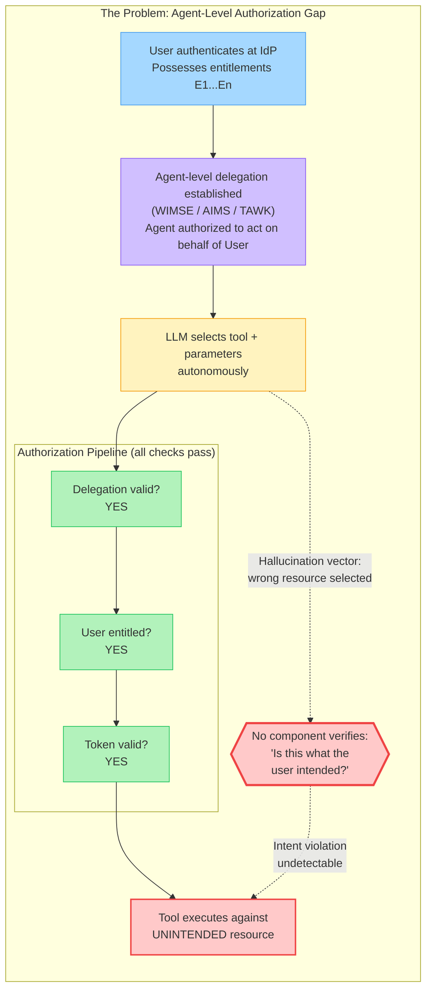
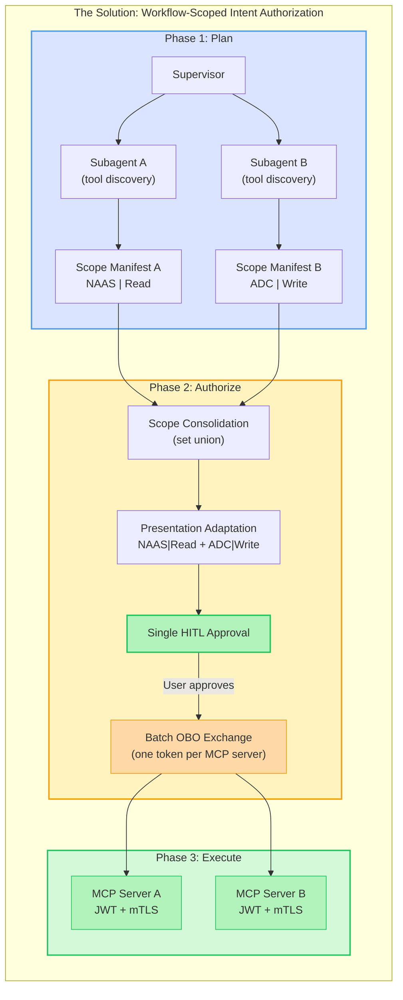
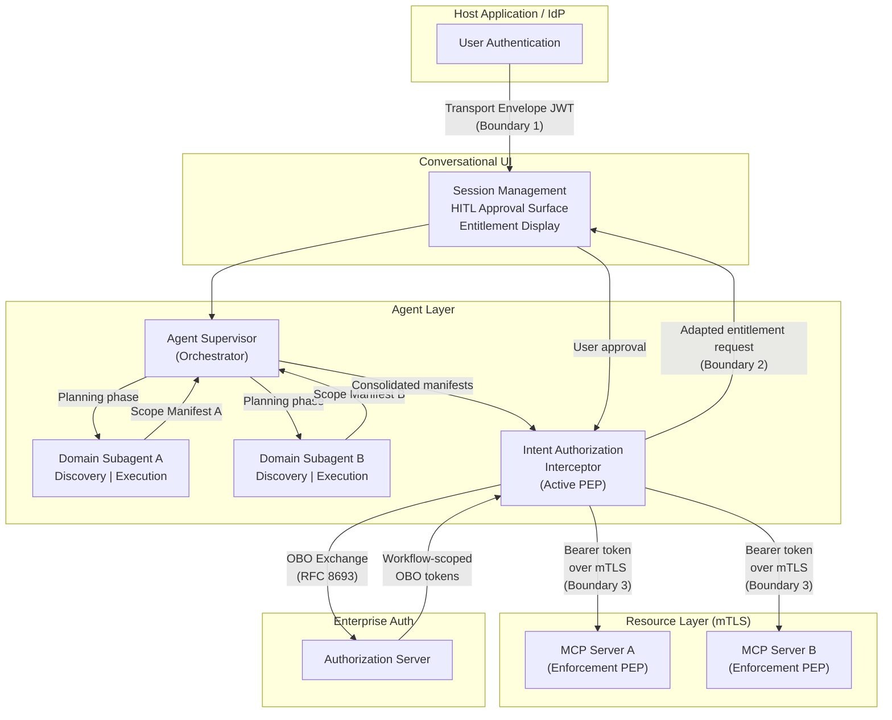
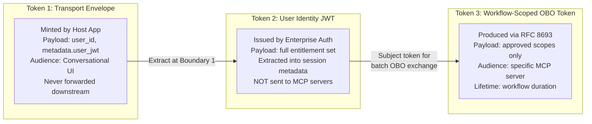
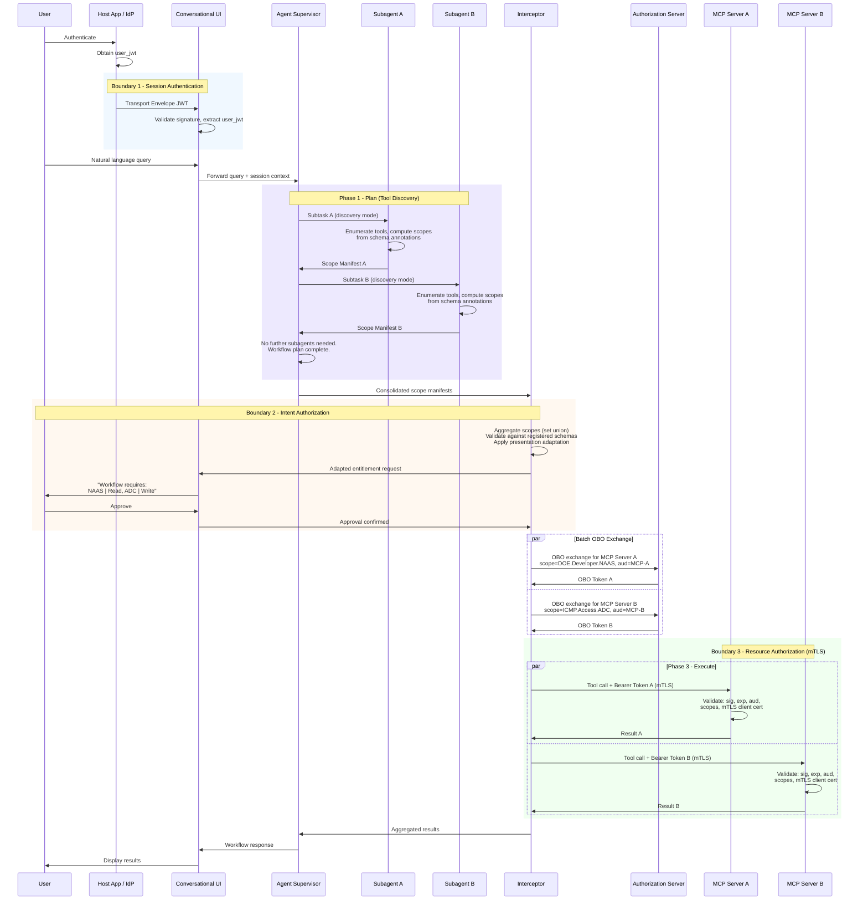

# User-Delegated Authorization with Intent-Bounded Scope Control for Agentic Frameworks

## RFC Frame - Working Draft v5

**Status:** Pre-draft frame for expansion into full RFC
**Pattern Name:** User-Delegated Authorization via Workflow-Scoped Token Exchange with Intent-Bounded Scope Control
**Target Audience:** Enterprise architects, identity/security engineers, agentic AI platform teams
**Revision Note:** v5 restructures the document for readability. No normative changes from v4. Prior art, normative requirement tables, and enterprise context relocated to appendices. Design rationale integrated inline. Definitions introduced at point of use rather than front-loaded.

---

## 1. Introduction

### 1.1 Purpose

This document describes how OAuth 2.1, RFC 8693 (Token Exchange), the Model Context Protocol (MCP), and mutual TLS compose to enforce identity propagation and intent-bounded scope control across multi-agent workflows in enterprise agentic architectures.

This is an applicability and composition document. It defines no new protocols. Reference implementations MAY leverage specific frameworks (LangGraph, FastMCP, langchain-mcp-adapters) but the pattern is vendor and framework agnostic.

### 1.2 Applicability

This pattern applies to agentic systems where:

- Users delegate intent to LLMs that autonomously design multi-step workflows spanning multiple domain-specific subagents and resource servers.
- Each resource server requires authenticated user identity propagated from the originating session.
- The scope exercised at terminal resource servers must reflect the user's expressed intent rather than the LLM's inference.
- Federated governance applies: service-providing teams own and operate their MCP resource servers independently.

This pattern does not address non-agentic systems, systems without human-in-the-loop requirements, single-operator deployments, or public API surfaces without enterprise governance.

### 1.3 The Problem

Two gaps exist in current agentic authorization models.

**The Identity Propagation Gap.** The MCP specification (2025-11-25) prescribes OAuth 2.1 with PKCE for client-to-server authentication, addressing how an MCP client authenticates to an MCP server. In enterprise agentic architectures, users authenticate once at a host application. From that point, the user's identity, authorization context, and entitlement boundaries must propagate through the conversational UI, agent orchestrator, domain subagents, and MCP resource servers. None of these downstream components participate in the original authentication. Without explicit identity propagation, MCP tools either operate with system-level privileges or require ad-hoc credential management per user. Neither satisfies enterprise compliance requirements.

**The Intent Verification Gap.** Agent identity and delegation models - WIMSE dual-identity credentials, AIMS delegation, agent entitlement governance - establish whether an agent is authorized to act on behalf of a user. They do not establish whether a specific action is what the user intended. In traditional OAuth, the user explicitly selects resources. In agentic architectures, an LLM translates natural language into structured tool invocations. If the LLM hallucinates or misinterprets intent, it may invoke tools against unintended resources while operating within the user's valid entitlement set. Every delegation check passes. Every token validates. But the authorization intent has been violated. The user's entitlement set becomes a surface area for hallucination-driven scope misuse, and no component in the existing pipeline detects or prevents it.

**These gaps compound.** Identity must propagate end-to-end. Scope must reflect intent, not inference. And in multi-agent workflows spanning multiple subagents and servers, intent verification must operate at the workflow level to provide both security and usable consent ergonomics.



### 1.4 The Solution: Three-Phase Workflow Authorization

This pattern closes both gaps through a three-phase model: Plan, Authorize, Execute. The key insight is that authorization operates at workflow granularity, not per-tool. The user sees the complete action surface once and approves or denies it as a unit, rather than facing N approval prompts for N tools.

**Phase 1 - Plan.** The agent orchestrator (Supervisor) dispatches subtasks to domain subagents in discovery mode. Each subagent enumerates the tools it would invoke and computes a scope manifest - a structured declaration of required entitlements derived deterministically from tool schema annotations. No tools execute.

**Phase 2 - Authorize.** An Intent Authorization Interceptor aggregates all scope manifests, deduplicates, transforms raw scope identifiers into human-readable descriptions, and presents a single consolidated approval request to the user. On approval, the Interceptor performs batch On-Behalf-Of (OBO) token exchange (RFC 8693) to produce workflow-scoped tokens, one per target MCP server.

**Phase 3 - Execute.** Subagents invoke tools using the workflow-scoped OBO tokens over mutual TLS. Each MCP resource server validates the token locally (signature, audience, scopes, expiration) with no runtime calls to authorization infrastructure.



The complete end-to-end sequence diagram showing all three phases and boundaries is in Section 2.6.

**Why workflow-scoped, not per-tool?** Per-tool authorization requires N HITL prompts for an N-tool workflow. Users habituate to approving and stop reviewing - the opposite of the security goal. Workflow-scoped authorization presents the complete action surface once, at a granularity where the user can meaningfully evaluate what the agent intends to do. It also eliminates runtime dependencies between MCP servers and authorization infrastructure: the OBO token is self-contained, validated locally via JWT mechanics and mTLS.

### 1.5 System Components

Six logical components participate in the two-phase pipeline (planning followed by execution):

**Host Application / IdP** - Where the user authenticates. Holds or obtains the user's identity token (JWT) from enterprise authorization infrastructure.

**Conversational UI** - The user-facing assistant interface. Manages session state, provides the HITL approval surface, and renders adapted entitlement presentations.

**Agent Supervisor** - The multi-agent orchestrator. Decomposes queries into domain subtasks, dispatches to subagents, collects scope manifests during planning, and coordinates tool invocations during execution. The Supervisor is a service boundary but explicitly not an authorization boundary - it does not evaluate credentials.

**Domain Subagents** - Specialized agents operating within a single domain (e.g., network services, finance). Each subagent is associated with one or more MCP resource servers and operates in two modes: discovery mode (enumerate tools, return scope manifest, no execution) and execution mode (invoke tools using pre-authorized tokens). Subagents are platform-controlled runtime components. The tool schemas and scope annotations they reference are authored by service-providing teams at registration time and stored in the agent configuration registry. The subagent runtime resolves these team-authored schemas deterministically; it does not author or modify them.

**Intent Authorization Interceptor** - The Active Policy Enforcement Point (PEP). Aggregates scope manifests, consolidates entitlements, adapts them for user presentation, solicits HITL approval, and performs batch OBO token exchange.

**MCP Resource Server(s)** - Team-owned servers hosting service-specific tools. Each validates incoming OBO tokens via self-contained JWT mechanics and enforces scope-based access control. All Interceptor-to-MCP communication occurs over mutual TLS.



### 1.6 Token Architecture

Three token types participate in the flow. Each has a distinct scope, audience, and lifecycle:

**Transport Envelope Token** - Minted by the Host Application. Contains the user identifier and an embedded `user_jwt`. Audienced to the Conversational UI. Validated at session establishment and never forwarded downstream.

**User Identity Token (user_jwt)** - Issued by the enterprise Authorization Server. Contains the user's complete entitlement set. Extracted from the Transport Envelope at session setup and stored securely in session state. Never sent directly to MCP resource servers.

**Workflow-Scoped OBO Token** - Produced by the Interceptor via RFC 8693 token exchange after user approval. Scoped to exactly the approved entitlements. Audienced to a specific MCP resource server. One token per target server per workflow. This is the only token MCP resource servers accept.



---

## 2. Authorization Model

This architecture defines three authorization boundaries. Each boundary has a distinct trust question, a classified Policy Enforcement Point (PEP), and a co-located threat model.

### 2.1 Boundary 1 - Session Authentication

**PEP Classification:** Passive PEP
**Trust Decision:** Is this a legitimate user session from a trusted application?

The Conversational UI validates the Transport Envelope Token's cryptographic signature, extracts the `user_jwt`, and stores it encrypted at rest in session state. This boundary establishes session legitimacy. It MUST NOT evaluate entitlements, scopes, or resource-level authorization, and MUST NOT forward the Transport Envelope downstream.

**Threats:** Session credential exposure (the `user_jwt` is a bearer credential; implementations SHOULD bind sessions to client fingerprints) and envelope replay (Transport Envelope Tokens SHOULD carry a `jti` claim for replay detection).

### 2.2 Boundary 2 - Intent Authorization

**PEP Classification:** Active PEP
**Trust Decision:** What does this user intend to authorize this workflow to do?

This is the boundary that closes the intent verification gap. Before it, the system knows what the user *can* do (entitlements). After it, the system knows what the user *wants to do right now* (intent). The mechanism operates at workflow granularity.

The Interceptor aggregates scope manifests from all subagents, deduplicates via set union, validates each scope against registered tool schema annotations, transforms them into human-readable descriptions using deterministic mappings defined at tool registration, and presents the consolidated request to the user. The presentation identifies the tools to be invoked, target resources, access mode, and MCP servers involved.

On approval, the Interceptor performs batch OBO token exchange (Section 3.4) and creates an auditable consent record (user identifier, approved entitlements, workflow plan ID, constituent tools, timestamp). On denial, the entire workflow halts with no OBO exchange and a non-error return to the conversational flow.

The Interceptor MUST run in a trusted execution context within the platform, not within team-owned infrastructure. Communication with the Authorization Server MUST be mutually authenticated. Consent records SHOULD be tamper-evident.

**Threats:**

- *Hallucination-driven scope misuse* - the primary threat. Without HITL, the LLM can exercise any scope in the user's entitlement set without user awareness. Workflow-level approval makes the full scope visible before any tool executes.
- *Interceptor compromise* - the Interceptor holds the OBO exchange privilege. Mutual authentication, trusted execution, and tamper-evident consent records mitigate this.
- *Scope inflation via planning* - a compromised subagent runtime could return an inflated manifest requesting entitlements beyond what the team-registered tool schemas declare. Because tool schemas and scope annotations are authored by service teams at registration time (not by the subagent at runtime), the Interceptor can validate that requested scopes correspond to registered annotations. Scopes not derivable from registered schemas MUST be rejected.

### 2.3 Boundary 3 - Resource Authorization

**PEP Classification:** Enforcement PEP
**Trust Decision:** Is this action permitted by the presented token, over an authenticated transport?

This boundary is strict and mechanical. It does not reason about intent - that was resolved at Boundary 2. This boundary is owned and operated by the service-providing team.

Each MCP resource server validates: the OBO token's cryptographic signature (against the Authorization Server's public key), `exp` and `nbf` claims, `aud` claim (must match this server's resource identifier), and scopes (compared against the tool's declared requirements for the given parameters). The server also authenticates the Interceptor's client certificate via mTLS. If any validation step fails, the tool MUST NOT execute. The server MUST NOT call external authorization endpoints (user-info, introspection) at request time - the OBO token is self-contained.

**Why no runtime authorization calls?** In a per-tool model, MCP servers call user-info endpoints for real-time revocation and scope hydration, coupling every tool invocation to authorization infrastructure (latency, availability, blast radius). In this workflow model, entitlement validation occurs once at OBO exchange time. Revocation within a token's lifetime is bounded by short lifetimes (5-15 minutes). This tradeoff - eventual consistency over the token window versus real-time revocation per call - is standard practice for short-lived JWTs in OAuth 2.0.

**Threats:** Audience bypass (failure to validate `aud` permits cross-service replay), mTLS misconfiguration (must be validated during onboarding), and stale entitlements within token lifetime (bounded by short lifetimes).

### 2.4 Mandatory Path Enforcement

The MCP resource server validates `aud` and accepts only tokens audienced to itself - only the Interceptor produces such tokens via OBO exchange. The server also authenticates the Interceptor's identity via mTLS client certificate.

These two properties create dual enforcement. A direct attempt with the user's broad token fails on audience mismatch. A direct attempt from an unauthorized client fails on mTLS handshake. The authorization path through the Interceptor is mandatory by cryptographic enforcement, not routing convention.

**Why both audience validation and mTLS?** Audience validation alone prevents token misuse across services. mTLS alone prevents unauthorized clients. Together they create a structurally enforced mandatory path: no valid token reaches an MCP server without the Interceptor's OBO exchange (audience constraint), and no client reaches the server without authenticating as the Interceptor (mTLS constraint). Neither depends on routing conventions or network configuration.

### 2.5 Non-Boundaries

The Agent Supervisor is a service boundary, not an authorization boundary. It coordinates workflow planning and execution but does not evaluate credentials. The boundary between the Supervisor and subagents is similarly a service boundary with no authorization decision.

### 2.6 End-to-End Authorization Flow



---

## 3. Workflow Lifecycle and MCP Integration

This section specifies the mechanics of each phase introduced in Section 1.4. Normative schemas for scope manifests, scope templates, and presentation adaptation mappings are deferred to the full RFC; this section defines the behavioral contracts and data flow.

### 3.1 Tool Discovery and Scope Manifests

Each tool's schema carries scope requirements via declarative annotations - scope templates in `inputSchema` extensions or tool-level `_meta` fields. During discovery mode, the subagent resolves these annotations against the LLM-selected parameters, producing concrete scope strings. The subagent MUST NOT consult the LLM about scope requirements.

**Why deterministic?** If the LLM were consulted about scopes, it could hallucinate scopes as it hallucinates parameters. Deterministic computation from tool schema annotations ensures scope selection is a function of the tool definition (controlled by the service team) and parameter values (visible to the user at HITL). The LLM influences scope only indirectly through parameter selection, which is surfaced for user review.

**Scope Manifest Structure (informative):**

```json
{
  "subagent": "network-services",
  "mcp_server": "naas-resource-server",
  "tools": [
    {
      "name": "get_load_balancer_config",
      "parameters": {"lb_id": "prod-lb-01"},
      "scopes": ["DOE.Developer.NAAS"],
      "access_mode": "read"
    }
  ]
}
```

### 3.2 Scope Consolidation and Presentation Adaptation

The Interceptor receives manifests from all subagents and produces a consolidated entitlement request. Scopes are aggregated via set union, deduplicated, grouped by target MCP resource server (each group produces one OBO token), and validated against registered tool schema annotations.

Raw scope identifiers (e.g., `DOE.Developer.NAAS`) are enterprise-internal strings not designed for user consumption. The Interceptor transforms them into a human-readable presentation using deterministic mappings defined at tool registration:

- **App-ID-specific entitlements** (scopes bound to a service identifier) map to `{service_name} | {access_mode}` (e.g., `NAAS | Read`).
- **Declarative entitlements** (tool-level scopes like `ticket:create`) map to `{tool_category} | {operation}`.

The adapted presentation conveys the service or resource, access mode, and the number of tools requiring each entitlement. Mappings MUST NOT involve LLM inference.

```
This workflow requires the following authorizations:

  NAAS       | Read    (1 tool: get_load_balancer_config)
  ADC        | Write   (1 tool: update_vip_config)
  ServiceNow | Create  (1 tool: create_incident_ticket)

Approve or Deny?
```

### 3.3 HITL Approval and OBO Token Exchange

The user reviews the consolidated entitlement request and approves or denies. Approval authorizes the entire workflow. Partial approval (selecting specific entitlements or tools) is OPTIONAL. Denial halts the entire workflow with no OBO exchange.

On approval, the Interceptor performs batch OBO token exchange (RFC 8693) with the enterprise Authorization Server. One exchange per target MCP server:

| Parameter | Value |
|-----------|-------|
| `grant_type` | `urn:ietf:params:oauth:grant-type:token-exchange` |
| `subject_token` | The user's `user_jwt` from session metadata |
| `subject_token_type` | `urn:ietf:params:oauth:token-type:jwt` |
| `scope` | Space-delimited approved scopes for this MCP server |
| `audience` | Target MCP server's resource identifier |
| `requested_token_type` | `urn:ietf:params:oauth:token-type:access_token` |

The Authorization Server validates the subject token and evaluates requested scopes against user entitlements, rejecting the exchange if any scope is unauthorized. Issued tokens are scoped to exactly the approved entitlements, audienced to the specific MCP server, and carry a workflow-scoped lifetime. Exchanges for multiple servers MAY execute concurrently.

### 3.4 Workflow Execution

With OBO tokens in hand, the Supervisor transitions from planning to execution. Subagents present the OBO token as a Bearer token in the Authorization header over the mTLS channel. Tools within a workflow MAY execute concurrently where no data dependency exists. Results are aggregated by the Supervisor and returned through the conversational flow.

### 3.5 Token Lifetime and Revocation

OBO tokens carry a finite lifetime scoped to the expected workflow duration (RECOMMENDED: 5-15 minutes). They MUST NOT be refreshed. If a workflow exceeds the token lifetime, the Supervisor re-initiates the full authorization lifecycle (plan, HITL, exchange) for remaining tools. This creates a second HITL prompt mid-workflow, which is an intentional tradeoff: the pattern prioritizes security (re-validating intent for long-running work) over UX smoothness. In practice, most enterprise agentic workflows complete within a single token window. Future work on risk-driven approval classification (Section 3.8) may allow low-risk continuations to proceed without re-prompting.

Entitlement revocation is enforced at OBO exchange time: if entitlements have been revoked since the last exchange, the Authorization Server rejects the request. Within a token's lifetime, revocation is bounded by expiration. This means a tool could execute with recently-revoked entitlements if revocation occurs after OBO exchange but before tool invocation. Short lifetimes (5-15 minutes) bound this exposure window. This tradeoff is consistent with standard short-lived JWT practice in OAuth 2.0 deployments.

### 3.6 Error Handling

**OBO Exchange Failures.** If any exchange in a batch fails, tools targeting that MCP server MUST NOT execute. Tools targeting other servers with successful exchanges SHOULD proceed.

**Token Validation Failures at MCP Resource Server:**

| Failure | Response |
|---------|----------|
| Invalid signature | 401 Unauthorized, `invalid_token` |
| Expired token | 401 Unauthorized, `token_expired` |
| Audience mismatch | 401 Unauthorized, `invalid_token` |
| Insufficient scopes | 403 Forbidden, `insufficient_scope` |
| Invalid mTLS certificate | TLS handshake failure (no HTTP response) |

In all cases, the tool MUST NOT execute.

**Workflow Execution Failures.** Workflows are resilient to individual tool failures. On transient failure, the subagent retries with exponential backoff. On persistent failure, the subagent reports to the Supervisor, which notifies the user and continues executing remaining tools. Results clearly indicate which tools succeeded and which failed.

### 3.7 Governance and Onboarding

Service-providing teams integrating into the platform must satisfy:

- **Agent Configuration Registration** - Register tool schemas with declarative scope annotations and presentation adaptation mappings in the agent configuration registry.
- **Tool Discovery Support** - MCP resource server supports `tools/list` with scope metadata in tool annotations or `_meta` fields.
- **Token Verification** - Implement the Boundary 3 pattern: OBO token signature validation, audience enforcement, scope enforcement, mTLS client certificate authentication.
- **mTLS Certificate Provisioning** - Provision a server certificate signed by the platform CA; configure the server to require the Interceptor's client certificate.
- **Scope Definition** - Define scopes per tool as templates that resolve deterministically from parameter values.
- **Infrastructure Ownership** - MCP resource servers are deployed and operated on the team's infrastructure. The platform does not host team-owned servers.
- **Compliance Validation** - The platform SHOULD validate compliance during onboarding via automated testing (correct/incorrect audience and scope combinations over mTLS, verifying accept/reject behavior).

### 3.8 Extensibility

**Agent Identity Composition (WIMSE).** Future versions SHOULD compose dual-identity credentials with this pattern, adding an optional `agent_id` claim to OBO tokens.

**Risk-Driven Approval Classification.** Tool-level risk metadata (leveraging MCP annotations like `readOnlyHint` and `destructiveHint`) could allow low-risk workflows to skip HITL while requiring approval for high-risk operations.

**Tool Discovery Standardization.** The scope manifest structure and discovery mode are currently application-level conventions. Standardizing as an MCP extension (additional `tools/list` fields or a `tools/scopes` RPC) would enable interoperability.

**MCP Server-to-Server Chaining.** When one MCP server invokes tools on another, the token propagation model requires extension via narrowing token chains.

**Audit Schema.** A standardized schema for consent records, OBO events, tool results, and workflow completion would support compliance and incident investigation.

**MCP Native OAuth Discovery.** This pattern and MCP's OAuth 2.1 discovery (RFC 9728) address different deployment topologies. Future work should define coexistence semantics.

---

## Appendix A: Normative Language

The key words "MUST", "MUST NOT", "REQUIRED", "SHALL", "SHALL NOT", "SHOULD", "SHOULD NOT", "RECOMMENDED", "NOT RECOMMENDED", "MAY", and "OPTIONAL" in this document are to be interpreted as described in BCP 14 [RFC2119] [RFC8174] when, and only when, they appear in all capitals, as shown here.

## Appendix B: Normative Requirements Summary

The following tables consolidate all normative requirements by component for implementer reference.

### B.1 Conversational UI

| ID | Requirement | Level | Source |
|---|---|---|---|
| CUI-1 | Validate Transport Envelope Token signature | MUST | 2.1 |
| CUI-2 | Extract and securely store user_jwt in session metadata | MUST | 2.1 |
| CUI-3 | Encrypt session storage at rest | MUST | 2.1 |
| CUI-4 | Not evaluate entitlements or scopes at this boundary | MUST NOT | 2.1 |
| CUI-5 | Not forward Transport Envelope Token downstream | MUST NOT | 2.1 |
| CUI-6 | Handle token expiration via session binding, refresh, or re-auth | MUST | 3.5 |

### B.2 Agent Supervisor

| ID | Requirement | Level | Source |
|---|---|---|---|
| SUP-1 | Dispatch subtasks to subagents in discovery mode during planning | MUST | 3.1 |
| SUP-2 | Collect scope manifests from all participating subagents | MUST | 3.1 |
| SUP-3 | Continue dispatching until workflow plan is complete | MUST | 3.1 |
| SUP-4 | Distribute correct OBO token to each subagent during execution | MUST | 3.4 |
| SUP-5 | Notify user of individual tool failures and continue remaining tools | MUST | 3.6 |
| SUP-6 | Not evaluate credentials or make authorization decisions | MUST NOT | 2.5 |

### B.3 Domain Subagents

| ID | Requirement | Level | Source |
|---|---|---|---|
| SUB-1 | Support discovery mode returning scope manifest without execution | MUST | 3.1 |
| SUB-2 | Compute scopes deterministically from schema annotations + parameters | MUST | 3.1 |
| SUB-3 | Not consult LLM for scope determination | MUST NOT | 3.1 |
| SUB-4 | Propagate scope manifest programmatically to Supervisor | MUST | 3.1 |
| SUB-5 | Retry transient tool failures with exponential backoff | SHOULD | 3.6 |
| SUB-6 | Report persistent tool failures to Supervisor | MUST | 3.6 |

### B.4 Intent Authorization Interceptor

| ID | Requirement | Level | Source |
|---|---|---|---|
| INT-1 | Aggregate scope manifests using set union, deduplicate | MUST | 3.2 |
| INT-2 | Group consolidated scopes by target MCP resource server | MUST | 3.2 |
| INT-3 | Validate scopes against registered tool schema annotations | SHOULD | 3.2 |
| INT-4 | Reject scopes not derivable from registered schemas | MUST | 3.2 |
| INT-5 | Apply deterministic presentation adaptation mappings | MUST | 3.2 |
| INT-6 | Present adapted entitlement request before any OBO exchange | MUST | 2.2 |
| INT-7 | On denial: halt workflow, no OBO exchange, non-error return | MUST | 2.2 |
| INT-8 | On approval: perform batch OBO exchange per Section 3.3 | MUST | 2.2 |
| INT-9 | Create auditable consent record per approval | MUST | 2.2 |
| INT-10 | Run in trusted execution context within platform | MUST | 2.2 |
| INT-11 | Mutually authenticate with Authorization Server | MUST | 2.2 |
| INT-12 | Consent records tamper-evident | SHOULD | 2.2 |
| INT-13 | Produce one OBO token per target MCP server | MUST | 3.3 |
| INT-14 | Not refresh OBO tokens | MUST NOT | 3.5 |

### B.5 MCP Resource Server

| ID | Requirement | Level | Source |
|---|---|---|---|
| RS-1 | Require and validate mTLS client certificate from Interceptor | MUST | 2.3 |
| RS-2 | Validate OBO token cryptographic signature | MUST | 2.3 |
| RS-3 | Validate exp and nbf claims | MUST | 2.3 |
| RS-4 | Validate aud claim matches server's resource identifier | MUST | 2.3 |
| RS-5 | Extract and compare scopes against tool requirements | MUST | 2.3 |
| RS-6 | Not invoke tool if any validation step fails | MUST NOT | 2.3 |
| RS-7 | Not call external authorization endpoints at request time | MUST NOT | 2.3 |
| RS-8 | Return 401 for signature, expiration, audience, mTLS failures | MUST | 3.6 |
| RS-9 | Return 403 for insufficient scope | MUST | 3.6 |

### B.6 Authorization Server

| ID | Requirement | Level | Source |
|---|---|---|---|
| AS-1 | Validate subject token during OBO exchange | MUST | 3.3 |
| AS-2 | Evaluate requested scopes against user entitlements | MUST | 3.3 |
| AS-3 | Reject exchange if user lacks any requested scope | MUST | 3.3 |
| AS-4 | Issue OBO token scoped to exactly approved entitlements | MUST | 3.3 |
| AS-5 | Audience-scope OBO token to specific MCP server | MUST | 3.3 |
| AS-6 | Issue tokens with workflow-scoped lifetime (5-15 min recommended) | SHOULD | 3.5 |

### B.7 Platform Governance

| ID | Requirement | Level | Source |
|---|---|---|---|
| GOV-1 | Teams register agent config with scope annotations and presentation mappings | MUST | 3.7 |
| GOV-2 | Teams implement token verification per Section 2.3 | MUST | 3.7 |
| GOV-3 | Teams support tool discovery via tools/list with scope metadata | MUST | 3.7 |
| GOV-4 | Teams provision mTLS certificates signed by platform CA | MUST | 3.7 |
| GOV-5 | Scopes deterministically resolvable from tool parameters | MUST | 3.7 |
| GOV-6 | Platform not host team-owned MCP servers | MUST NOT | 3.7 |
| GOV-7 | Platform validate compliance via automated testing including mTLS | SHOULD | 3.7 |

## Appendix C: Standards and Prior Art

### C.1 IETF Drafts

- **draft-klrc-aiagent-auth-00** (March 2026) - Agent Identity Management System (AIMS). Proposes a layered conceptual model from Identifier through Compliance. This document's intent authorization boundary extends AIMS's delegation model by verifying that delegated actions match user intent.
- **draft-ni-wimse-ai-agent-identity-02** - WIMSE applicability for AI agents. Dual-identity credentials binding agent to owner/user identity. This pattern is complementary: WIMSE establishes *who*; this pattern establishes *what* in a specific interaction.
- **draft-rosenberg-cheq-00** - CHEQ protocol for HITL confirmation. CHEQ operates at the token request level; this pattern operates at workflow level and produces deterministically-scoped credentials.
- **draft-zheng-dispatch-agent-identity-management-00** - Agent registration and gateway-based identity management.
- **draft-abbey-scim-agent-extension-00** - SCIM extension for provisioning AI agents.
- **draft-yl-agent-id-requirements-00** - Requirements for digital identity in AI agent communication.

### C.2 OAuth, Identity, and Transport Standards

- **OAuth 2.1 (IETF Draft)** - Foundation for MCP authorization flows.
- **RFC 8693 (Token Exchange)** - Framework for exchanging one security token for another. Basis for OBO exchange.
- **RFC 7662 (Token Introspection)** - Protocol for resource servers to query token metadata.
- **RFC 8707 (Resource Indicators)** - Mechanism for clients to indicate target resource servers.
- **RFC 9728 (Protected Resource Metadata)** - Discovery mechanism for MCP servers to advertise authorization server locations.
- **RFC 8446 (TLS 1.3)** - Basis for mutual TLS requirement.

## Appendix D: Enterprise Context

The following terms describe the originating deployment context. The patterns in this document are vendor and framework agnostic.

**Agent Entitlement Governance Framework** - A pattern for declaring agent-level authorization boundaries and entitlements. Governs whether a user may engage a specific agent. This document extends authorization beyond agent-level governance to workflow and resource server boundaries. (Reference implementation: TAWK.)

**Tachyon** - Internal service name and API gateway for cloud model access. Referenced for context only.

**IDP Chatbot** - The multi-agent virtual assistant platform where this pattern originates.

**Agent Configuration Registry** - Central registry for agent configurations, tool schemas, scope annotations, presentation adaptation mappings, and entitlement requirements.

## Appendix E: References

### E.1 Normative References

- [RFC2119] Bradner, S., "Key words for use in RFCs to Indicate Requirement Levels", BCP 14, RFC 2119, March 1997.
- [RFC8174] Leiba, B., "Ambiguity of Uppercase vs Lowercase in RFC 2119 Key Words", BCP 14, RFC 8174, May 2017.
- [RFC8446] Rescorla, E., "The Transport Layer Security (TLS) Protocol Version 1.3", RFC 8446, August 2018.
- [RFC8693] Jones, M., et al., "OAuth 2.0 Token Exchange", RFC 8693, January 2020.
- [RFC8707] Campbell, B., et al., "Resource Indicators for OAuth 2.0", RFC 8707, February 2020.
- [RFC9728] Jones, M., "OAuth 2.0 Protected Resource Metadata", RFC 9728.

### E.2 Informative References

- [draft-klrc-aiagent-auth-00] Agent Identity Management System (AIMS), March 2026.
- [draft-ni-wimse-ai-agent-identity-02] Ni, Y. and C. P. Liu, "WIMSE Applicability for AI Agents", February 2026.
- [draft-rosenberg-cheq-00] Rosenberg, J., et al., "CHEQ: A Protocol for Confirmation AI Agent Decisions with HITL", July 2025.
- [draft-zheng-dispatch-agent-identity-management-00] Agent registration and gateway-based identity management.
- [draft-abbey-scim-agent-extension-00] SCIM extension for AI agent provisioning.
- [draft-yl-agent-id-requirements-00] Requirements for digital identity in AI agents.
- [RFC7662] Richer, J., "OAuth 2.0 Token Introspection", RFC 7662, October 2015.

## IANA Considerations

This document composes existing standards and introduces no new IANA registry entries. If the scope annotation schema or tool discovery protocol are standardized, IANA registrations may be required in future revisions.
